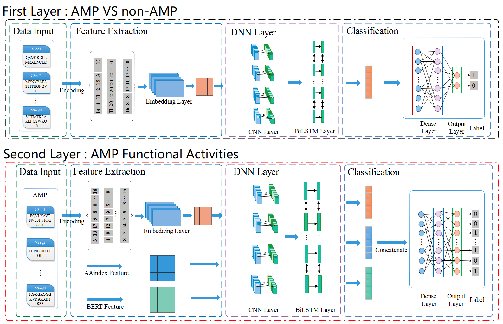

# CBLAMP
A two-layer predictive model of antimicrobial peptides and their functional activities based on CNN-BiLSTM classifier


## Introduction
Antimicrobial peptides (AMPs) are essential components for immune defenses of multicellular organisms. As excellent candidates of conventional antibiotics, AMPs possess various sub-functions, including anti-viral, anti-fungal, anti-cancer, mammalian cell inhibitory, and anti-parasitic activities. Considering the importance of AMPs, there is an urgent need for recognizing AMPs and their functional activities quickly and accurately. To solve this problem, we proposed a two-level model CBLAMP for predicting AMPs and their sub-functional activities. The 1st-level model CBLAMP-1L employed the binary classification based on CNN-BiLSTM to identify AMPs. While the 2nd-level model CBLAMP-2L predicted the seven sub-functional activities of AMPs based on the multi-label CNN-BiLSTM module, and this model uses three groups of features, namely sequence embedding features, AAindex physicochemical features, and BERT features. These features were integrated to further improve the predictive accuracy. A comparison of the predictions between CBLAMP and the two-layer prediction models TransImbAMP,binary classification models and multi-label models confirmed the excellent performance of the CBLAMP model.




## Related Files

#### CBLAMP

| FILE NAME           | DESCRIPTION                                                  |
| :------------------ | :----------------------------------------------------------- |
| main.py             | the main file of CBLAMP predictor (include data reading, encoding, and data partitioning) |
| train.py            | train model |
| model.py            | model construction |
| test.py             | test model result |
| evaluation.py       | evaluation metrics (for evaluating prediction results) |
| aaindex.py          | extract the aaindex feature file           |
| data                | data         |


## Features

### BERT Features

If you need to extract BERT features, please refer to https://github.com/BioSequenceAnalysis/Bert-Protein.

### AAindex Features
```
python aaindex.py
```


## Installation
- Requirement
  
  OS：
  
  - `Windows` ：Windows7 or later
  
  - `Linux`：Ubuntu 16.04 LTS or later
  
  Python：
  
  - `Python` >= 3.6
  
- Download `CBLAMP`to your computer

  ```bash
  git clone https://github.com/YannanBin/CBLAMP.git
  ```

## Contact
Please feel free to contact us if you need any help.
